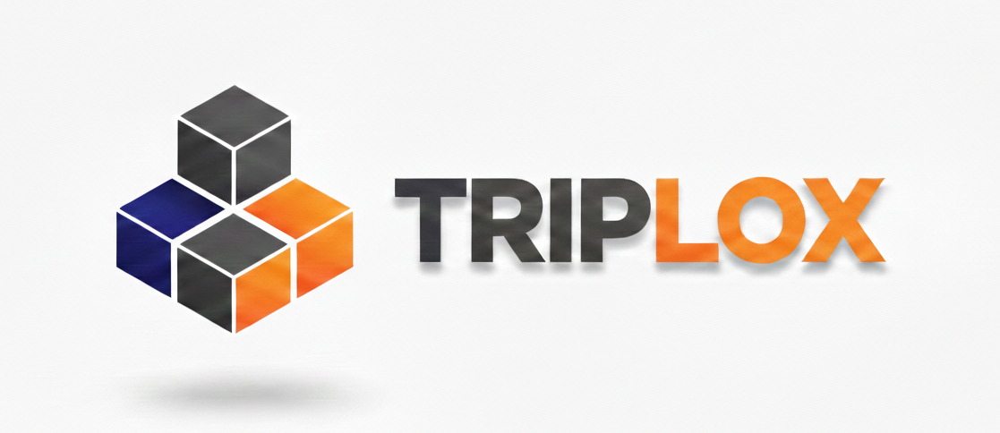

<p align="center">
  <!--  -->
  <picture>
    <source media="(prefers-color-scheme: dark)" srcset="img/triplox_wordmark_dark.svg">
    <source media="(prefers-color-scheme: light)" srcset="img/triplox_wordmark_light.svg">
    
  </picture>
  <br>
  <br>
  <a href="https://triplox.xyz">
    
  </a>
  <a href="https://www.apache.org/licenses/LICENSE-2.0">
    
  </a>
  <a href="https://discord.gg/CYaAYFwC">
    
  </a>
  <!-- <a href="https://crates.io/crates/triplox-client"> -->
  <!--    -->
  <!-- </a> -->
</p>

> 🚧 **WARNING: Alpha Software** 🚧
> Triplox is alpha software. The index encoding has not yet stabilized. There will be bugs. There will be ingestion and congestion issues. Incremental queries will likely be slow.

# Triplox

Triplox is a [Datomic](https://www.datomic.com/)-inspired general-purpose database on top of object storage. The backbone of the engine is [SlateDB](https://github.com/slatedb/slatedb/), a key-value store on top of object-storage. Datomic is the main inspiration and the data model, transaction semantics and query API closely follow Datomic.

The ideas of Triplox are roughly the following (in no particular order):
- Object storage centric. In it's final version Triplox should simply need a single (or likely two) S3 buckets for deployment. This is currently not the case. See [Architecture](###Architecture) below.
- The Datomic data model and API as main inspiration. Datomic is awesome. Lets bring it directly to object storage.
- A Client/Server architecture. I hope that this will open the door to ecosystems outside of the JVM (where Datomic has had it's main success).
- Incremental Datalog queries. You should be able to dynamically subscribe and detach from incremental Datalog queries. This is the most experimental part of Triplox and will need quite a bit of engineering effort to get right, make fast, and fully support of all features of Datalog. See [this page](https://triplox.xyz/incremental-queries/overview/) for an introduction. Views can be built on top of
them. We use [Feldera](https://github.com/feldera/feldera)'s [DBSP](https://crates.io/crates/dbsp) crate under the hood.

### Getting started

The easiest way to test Triplox is to just pull the [docker image](https://github.com/FiV0/triplox/pkgs/container/triplox) and start an in-memory or local node.
```bash
docker pull ghcr.io/fiv0/triplox:0.1.0-alpha.8
docker run -p 5490:5490 ghcr.io/fiv0/triplox:0.1.0-alpha.8
```
This will start a Triplox server with an in-memory DB to which you can connect at 5490. If you want an persistent local node, you start the image with
```bash
docker run -p 5490:5490 -e TRIPLOX_STORAGE=local -v triplox-data:/var/lib/triplox  ghcr.io/fiv0/triplox:0.1.0-alpha.8
```
In case you are already convinced and want to deploy Triplox in a distributed setting I suggest you have a look at the
[Operations](https://triplox.xyz/operations/overview/) section on the website.

There is also the option to run Triplox in `dev` mode which is particular useful for testing.
```bash
docker run -p 5490:5490 -e TRIPLOX_STORAGE=dev ghcr.io/fiv0/triplox:0.1.0-alpha.8
```
In this case a new in-memory DB is created on every connection.

Afterwards you connect with your favorite client.
```clj
(require '[xyz.triplox.api :as tc])

(def conn (tc/connect "localhost" 5490))

;; schema
(tc/transact conn [{:db/ident :name
                    :db/valueType :db.type/string
                    :db/cardinality :db.cardinality/one}
                   {:db/ident :age
                    :db/valueType :db.type/long
                    :db/cardinality :db.cardinality/one}])

;; data
(tc/transact conn [{:name "alice" :age 30}
                   {:name "bob" :age 25}])

;; query
(def db (tc/db conn))
(tc/q db '{:find [?e ?name ?age]
           :where [[?e :name ?name]
                   [?e :age ?age]]})
;; => [[8796093022209 "alice" 30] [8796093022208 "bob" 25]]
```

Triplox also supports [incremental queries](https://triplox.xyz/incremental-queries/overview/). If you want
to understand or get a feeling for how Triplox deals with incremental queries you can have a look at
the [incremental tutorial](https://github.com/FiV0/triplox-incremental-tutorial).

### Clients

- [Rust](https://triplox.xyz/apis/rust/)
- [Clojure](https://triplox.xyz/apis/clojure/)
- [Java](https://triplox.xyz/apis/java/)
- Go (TODO)
- Python (TODO)
- TS/Cljs (TODO)

If you would like to create another client there is a [PROTOCOL](design/PROTOCOL.md) design doc that should help. Currently the
HTTP/2 server only supports a custom MessagePack encoding scheme. We plan to add support for `transit+json` and `transit+msgpack`
in the future.

### Architecture

By making object storage the single source of truth, you get separation of storage and compute. SlateDB has a single writer and many readers architecture and that directly translates to Triplox. Triplox sits in the traditional client/server camp. Queries run on the server. For example limiting your query results would be done with `:limit` in a EDN Datalog query instead of doing it application code side.

The layout of the indices and also SlateDB's focus are [OLTP](https://en.wikipedia.org/wiki/Online_transaction_processing) queries. If you expect columnar layout performance for [OLAP](https://en.wikipedia.org/wiki/Online_analytical_processing) style queries, Triplox is not the right fit. This doesn't mean Triplox doesn't support aggregates, it will just not beat something like [DuckDB](https://github.com/duckdb/duckdb) on these types of queries. Also keep in mind that the architecture favors read heavy workloads. Triplox is currently single writer.

A typical setup for Triplox with 3 nodes (1 primary writer node + 2 readers nodes) would then roughly look like the diagram below.
Transactions get send to the log to get a [total-order](https://en.wikipedia.org/wiki/Total_order) and then indexed through
the primary indexing node into SlateDB. Reads can then be served from the primary node immediately and form any reader node
as soon as the reader nodes receive new WALs (Write-Ahead Logs) from Object Storage.

There are some design decisions that still are up for grabs. In particular the external log has been a thorn in my side and I would like to get rid of it. See [Open Questions > Log](https://triplox.xyz/roadmap/open-questions/#log) on the website.

```

                   ┌─────────────────────────────────────────────────────────────┐
                   │                   Object Storage (S3)                       │
                   │                                                             │
                   │  ┌─────────────┐      ┌─────────────┐      ┌─────────────┐  │
                   │  │   SlateDB   │      │   SlateDB   │      │   SlateDB   │  │
                   │  │  (Writer)   │      │  (Reader 1) │      │  (Reader 2) │  │
                   │  └──────┬──────┘      └──────┬──────┘      └──────┬──────┘  │
                   │         │                    │                    │         │
                   └─────────┼────────────────────┼────────────────────┼─────────┘
                             │                    │                    │
     Queries/Indices         ▲ read/write         ▼ read               ▼ read
                             │                    │                    │
        ┌────────────────────┴────────┐  ┌────────┴────────┐  ┌────────┴───────┐
        │         Writer Node         │  │  Reader Node 1  │  │  Reader Node 2 │
        │                             │  │                 │  │                │
        │      ┌──────────────┐       │  │                 │  │                │
  ┌─────┼────▶│   Indexer    │       │  │                 │  │                │
  │     │      └──────────────┘       │  │                 │  │                │
  │     │                             │  │                 │  │                │
  │     └─────────────┬───────────────┘  └─────────────────┘  └────────────────┘
  │                   │
  │  Transactions     │ write
  │                   ▼
  │     ┌──────────────────────────────────────────────────────────────────────┐
  │     │                                                                      │
  │     │                 Log (Kafka, S2, WAL3, etc.)                          │
  │     │                                                                      │
  │     │    ┌─────┬─────┬─────┬─────┬─────┬─────┬─────┬─────┐                 │
  └─────┼────┤ tx0 │ tx1 │ tx2 │ tx3 │ tx4 │ tx5 │ tx6 │ ... │                 │
   read │    └─────┴─────┴─────┴─────┴─────┴─────┴─────┴─────┘                 │
        │                                                                      │
        └──────────────────────────────────────────────────────────────────────┘
```

### Getting involved

This project is very much WIP and any help is appreciated. Discussions and feedback happen on [Discord](https://discord.gg/CYaAYFwC).

There is lots of things to work on. Feel free to open tickets for features, bugs or general ideas.
If you are building something more involved it's likely better to discuss it first
(either on Discord or in a ticket) and see if it fits the projects scope.

There are some more open questions that I tried to write down on the [website](https://triplox.xyz/roadmap/open-questions/)

### Acknowledgements

The primary inspiration is Datomic and you will see it's impact throughout the project. [Mentat](https://github.com/mozilla/mentat) (from which the edn crate is copied) has been a great inspiration and help in designing the transaction pipeline of Triplox.
The folks at [Feldera](https://github.com/feldera/feldera) have created the very clean and elegant DBSP theory without the incremental queries would not be possible.

### Compatibility

The goal is not to have a 1-to-1 correspondence of features with Datomic. Datomic is the main inspiration and we'll strive to stay
close to the Datomic APIs, but don't plan for feature parity nor identical behavior in all cases. The main differences will currently show up in the transaction pipeline. I am currently not dealing with schema updates. There might also be edge cases where the
transaction pipeline semantics slightly differ. There are currently two separate query
engines at play, one for standard queries and one for incremental queries (at some point in the future these [might converge](https://triplox.xyz/roadmap/roadmap/#collapsing-the-dbsp-gap-and-removing-the-standard-query-engine)).
It should generally be the case that the standard query engine supports a superset of queries the incremental engine supports.

### About

Some of the ideas of this repository have been explored in [hooray2](https://github.com/fiV0/hooray2), a simpler in-memory Datalog
engine. Especially WCOJ (Worst-case optimal joins) and Datalog to DBSP compilation have been explored there. It often
serves as a testbed of ideas for Triplox.

### Licence

Triplox is licensed under the Apache License, Version 2.0.

The [edn](edn/) crate was orginally copied from [mentat](https://github.com/mozilla/mentat) and is also licenced under Apache Licence, Version 2.0.
